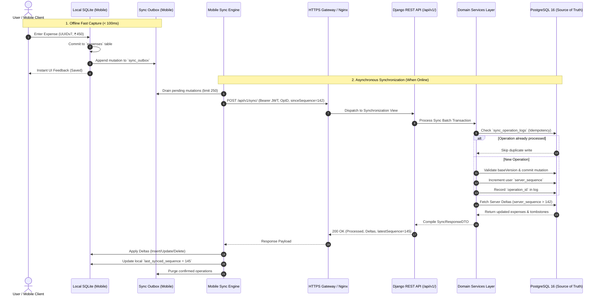

# Offline Synchronization Protocol (`POST /api/v1/sync/`)

## 1. End-to-End Sequence Flow



---

## 2. Request Contract (`POST /api/v1/sync/`)

```json
{
  "deviceId": "018d3a50-7f22-7901-8653-a83d47d0e9a1",
  "sinceSequence": 142,
  "operations": [
    {
      "operationId": "018d3a50-c001-7a11-8000-111122223333",
      "entityType": "EXPENSE",
      "entityId": "018d3a50-8b10-7e12-9214-5b4321fedcba",
      "operation": "CREATE",
      "baseVersion": 0,
      "payload": {
        "amount": "45.50",
        "currency": "USD",
        "categoryId": "018d3a50-7a01-7111-9988-aabbccddeeff",
        "transactionDate": "2026-09-13",
        "paymentMethod": "CASH",
        "payee": "Subway",
        "note": "Quick lunch",
        "clientCreatedAt": "2026-09-13T10:15:30.000Z"
      }
    },
    {
      "operationId": "018d3a50-c002-7a12-8000-444455556666",
      "entityType": "EXPENSE",
      "entityId": "018d3a50-8a00-7d00-9000-999988887777",
      "operation": "UPDATE",
      "baseVersion": 1,
      "payload": {
        "amount": "120.00",
        "note": "Adjusted dinner bill"
      }
    }
  ]
}
```

---

## 3. Response Contract

```json
{
  "processedOperations": [
    {
      "operationId": "018d3a50-c001-7a11-8000-111122223333",
      "entityId": "018d3a50-8b10-7e12-9214-5b4321fedcba",
      "status": "ACCEPTED",
      "serverVersion": 1,
      "serverSequence": 143
    },
    {
      "operationId": "018d3a50-c002-7a12-8000-444455556666",
      "entityId": "018d3a50-8a00-7d00-9000-999988887777",
      "status": "ACCEPTED",
      "serverVersion": 2,
      "serverSequence": 144
    }
  ],
  "serverChanges": {
    "expenses": [
      {
        "id": "018d3a50-ff99-7a88-8111-aabbccddeeff",
        "amount": "80.00",
        "currency": "USD",
        "categoryId": "018d3a50-7a01-7111-9988-aabbccddeeff",
        "transactionDate": "2026-09-12",
        "paymentMethod": "CREDIT_CARD",
        "payee": "Amazon",
        "note": "Office supplies (entered via Web)",
        "version": 1,
        "serverSequence": 145,
        "updatedAt": "2026-09-13T10:14:00.000Z"
      }
    ],
    "categories": [],
    "income": [],
    "budgets": [],
    "tombstones": [
      {
        "entityType": "EXPENSE",
        "entityId": "018d3a50-ee00-7000-8000-123456789abc",
        "serverSequence": 146,
        "deletedAt": "2026-09-13T10:16:00.000Z"
      }
    ]
  },
  "latestServerSequence": 146,
  "hasMore": false
}
```

---

## 4. Idempotency & Conflict Resolution Invariants

1. **Idempotency Check:** Every operation is validated against `sync_operation_logs` by `operationId`. Duplicated requests (e.g. from connection dropouts) are safely recognized and returned as `"ACCEPTED"` without creating duplicate rows.
2. **Conflict Resolution Policy:**
   - Evaluated via `baseVersion`.
   - Non-overlapping field updates are merged cleanly.
   - Direct overlapping field conflicts resolve via Last-Arriving Write Wins (LWW) ordered by server commit timestamp.
   - The authoritative server state is emitted in `serverChanges`, aligning all clients to the same truth.
3. **Tombstone Sync:** Permanently deleted or archived records are reported to mobile clients via `tombstones` arrays, directing SQLite to purge the local records.
