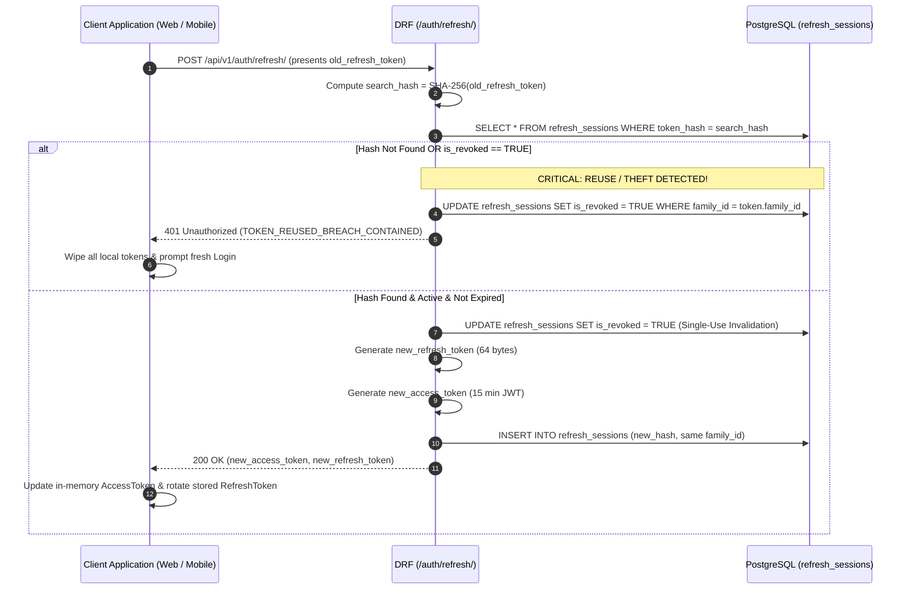
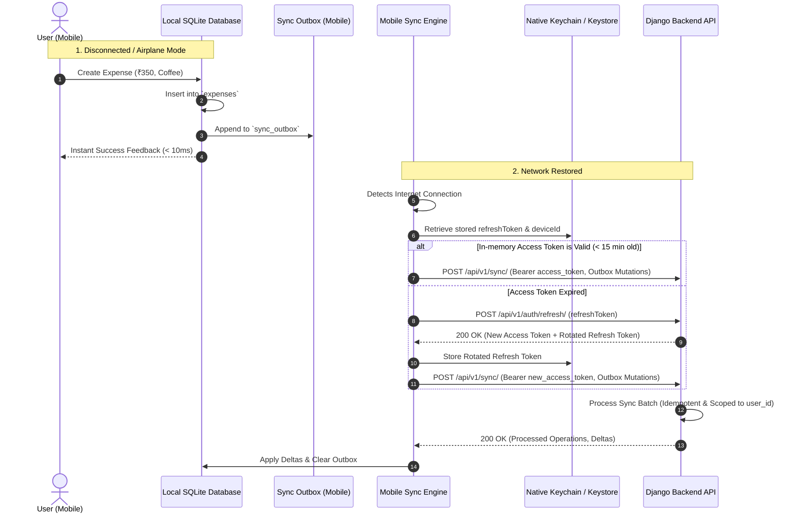

# Authentication & Authorization Architecture Specification

## 1. Security Architecture Overview
- **Access Tokens:** 15-minute stateless JWTs (`HS256`/`RS256`). Verified in-memory by Django REST Framework without hitting the database or cache.
- **Refresh Tokens:** 30-day stateful cryptographic opaque strings (64-byte high-entropy tokens, stored strictly as SHA-256 hashes in PostgreSQL in the `refresh_sessions` table).
- **Refresh Token Rotation (RTR):** Single-use tokens with automatic replay breach detection. Replaying an already-revoked refresh token revokes all tokens sharing that `family_id` and revokes the associated `device_id`.
- **Client Partitioning:**
  - **React Web:** In-memory access token + `HttpOnly`, `Secure`, `SameSite=Strict` cookie for refresh.
  - **React Native:** In-memory access token + Hardware Encrypted Storage (iOS Keychain / Android Keystore) for refresh.
  - **Local SQLite:** Plain data storage only; ZERO credentials, passwords, or tokens stored in SQLite.

---

## 2. Token Specifications & Claims

### Access Token Claims (JWT)
```json
{
  "iss": "https://api.expenseflow.com",
  "sub": "018d3a50-7f20-7f31-8cae-5c4d6a13a902",
  "device_id": "018d3a50-7f22-7901-8653-a83d47d0e9a1",
  "token_type": "access",
  "iat": 1789372800,
  "exp": 1789373700,
  "jti": "018d3a50-8b10-7e12-9214-5b4321fedcba"
}
```
*Prohibited in claims: Email, balances, roles, personal information.*

---

## 3. Database Schema: `refresh_sessions` Table

| Column | Type | Nullable | Default | PK/FK | Description |
|---|---|---|---|---|---|
| `id` | `UUID` | No | None | **PK** | UUIDv7 session identifier |
| `device_id` | `UUID` | No | None | **FK** | Ref `devices(id)` ON DELETE CASCADE |
| `token_hash`| `VARCHAR(64)` | No | None | Unique| SHA-256 hash of the 64-byte opaque token |
| `family_id` | `UUID` | No | None | Index | Lineage group for RTR reuse detection |
| `is_revoked`| `BOOLEAN` | No | `FALSE` | None | Revocation status flag |
| `expires_at`| `TIMESTAMPTZ`| No | None | Index | Expiration timestamp (30 days) |
| `created_at`| `TIMESTAMPTZ`| No | `NOW()` | None | Creation timestamp |
| `last_used_at`| `TIMESTAMPTZ`| No | `NOW()` | None | Timestamp of last refresh exchange |

---

## 4. Sequence Diagrams

### A. Login Flow (Web & Mobile)
```mermaid
sequenceDiagram
    autonumber
    actor User as User
    participant App as React Web / React Native
    participant Gateway as HTTPS Gateway (Nginx)
    participant DRF as Django REST API (/auth/login/)
    participant PG as PostgreSQL (users, devices, refresh_sessions)
    participant SecStore as Secure Storage (Cookie / Keychain)

    User->>App: Enters Email & Password
    App->>Gateway: POST /api/v1/auth/login/ (email, password, device metadata)
    Gateway->>DRF: Dispatch Login Request
    
    DRF->>PG: SELECT user WHERE email = normalized_email
    PG-->>DRF: User Record (password_hash, is_active)
    
    DRF->>DRF: Verify Argon2id(password, hash)
    alt Invalid Password
        DRF->>PG: Increment failed_login_attempts
        DRF-->>Gateway: 401 Unauthorized (INVALID_CREDENTIALS)
        Gateway-->>App: Display Error Message
    else Valid Password
        DRF->>PG: Reset failed_login_attempts
        DRF->>PG: Upsert `devices` record for device_id
        DRF->>DRF: Generate 64-byte Refresh Token
        DRF->>DRF: Compute SHA-256(RefreshToken)
        DRF->>PG: INSERT INTO refresh_sessions (token_hash, device_id, family_id)
        DRF->>DRF: Sign JWT Access Token (15 min, sub, device_id)
        
        alt Client is React Web
            DRF-->>Gateway: Set-Cookie: refresh_token (HttpOnly, Secure, SameSite=Strict)
            DRF-->>Gateway: 200 OK (AccessToken in JSON Body)
            Gateway-->>App: Store AccessToken in Memory; Cookie saved by Browser
        else Client is React Native
            DRF-->>Gateway: 200 OK (AccessToken + RefreshToken in JSON Body)
            Gateway-->>App: Receive Payload
            App->>SecStore: Save RefreshToken in iOS Keychain / Android Keystore
            App->>App: Set AccessToken in React Native Memory
        end
        App-->>User: Navigate to Dashboard / Capture Screen
    end
```

### B. Token Refresh with Reuse Detection (RTR)


### C. Offline Authentication & Sync Flow


---

## 5. Offline Authentication Rules
- **Access Token Expiry Offline:** Local SQLite operations continue without interruption. Token validity is evaluated only when network transmission is attempted.
- **Refresh Token Expiry (>30 Days Disconnected):** Sync engine pauses upon reconnecting; user is presented with a non-destructive re-login modal. Local SQLite records are completely preserved.
- **Device Revocation:** Upon reconnecting, device receives `401 Unauthorized (DEVICE_REVOKED)`, clears secure storage, and forces re-login.

---

## 6. Authorization & Anti-IDOR Invariants
- Mandatory tenant scoping on all queries: `WHERE user_id = request.user.id`.
- Accessing another user's UUID returns `404 Not Found` (never `403 Forbidden`).

---

## 7. Rate Limiting Rules
- `POST /api/v1/auth/login/`: 5 req/min (IP + Email).
- `POST /api/v1/auth/register/`: 3 req/hour (IP).
- `POST /api/v1/auth/refresh/`: 20 req/min (Device UUID).
- `POST /api/v1/auth/password-reset/`: 3 req/hour (IP + Email).
- `POST /api/v1/sync/`: 30 batches/min (User ID + Device UUID).
- Standard CRUD (`/expenses/`, etc.): 120 req/min (User ID).

---

## 8. Threat Model & Mitigations

| Threat | Attack Vector | Impact | Architecture Mitigation |
|---|---|---|---|
| **XSS** | Malicious script injected into Web frontend steals auth tokens. | Account takeover. | **Access tokens in JS memory only**; Refresh tokens in `HttpOnly` cookies. |
| **CSRF** | Cross-site request forgery attacks. | Unauthorized mutations. | Data endpoints mandate `Authorization: Bearer` header. Refresh uses `SameSite=Strict`. |
| **Token Theft & Replay** | Intercepted refresh token used by attacker. | Unauthorized ongoing access. | **RTR Reuse Detection:** Invalidated token reuse revokes entire family. |
| **IDOR** | Tampering with URL UUIDs. | Cross-user data access. | Strict tenant query scoping by `user_id`. Mismatches return `404 Not Found`. |
| **Hardware Theft** | Stolen mobile device. | Data exposure. | Credentials secured in hardware **Keychain / Keystore**. |
| **Brute Force** | Automated dictionary attacks. | Credential compromise. | Progressive delay + 5 req/min rate limit + **Argon2id** password hashing. |
