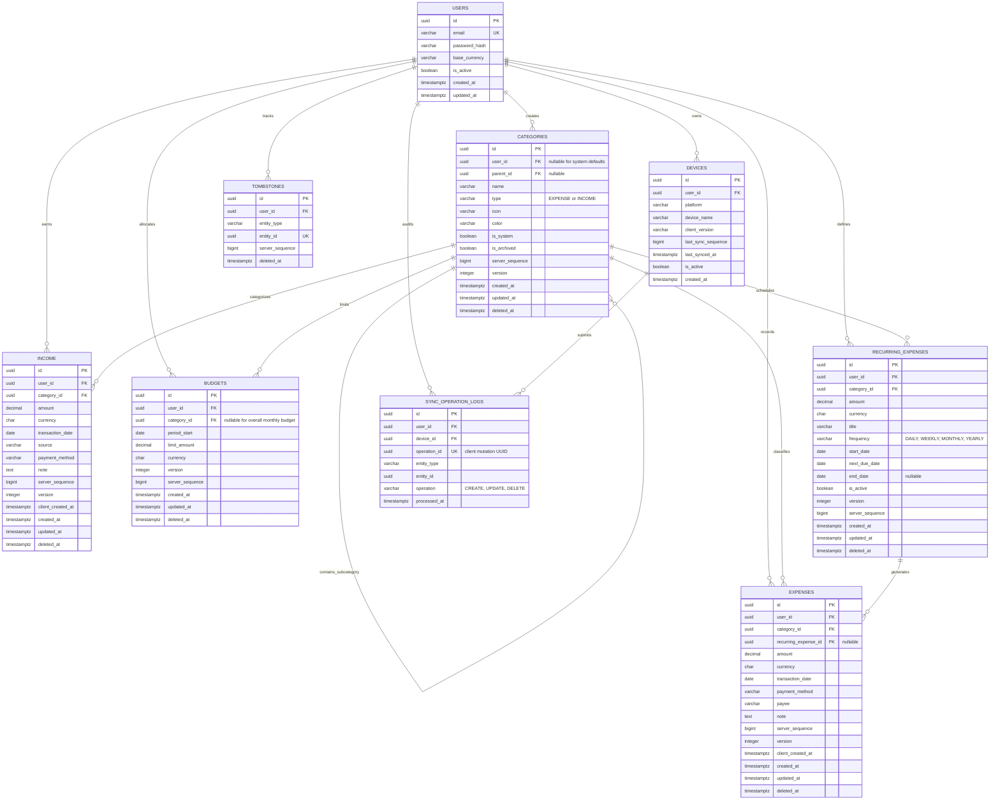

# Database Entity Relationship Diagram (ERD)

Authoritative server-side database: **PostgreSQL 16**
Primary Key Strategy: **UUIDv7 (Client & Server generated)**

```mermaid
erDiagram
    USERS ||--o{ DEVICES : owns
    USERS ||--o{ CATEGORIES : creates
    USERS ||--o{ EXPENSES : records
    USERS ||--o{ INCOME : earns
    USERS ||--o{ BUDGETS : allocates
    USERS ||--o{ RECURRING_EXPENSES : defines
    USERS ||--o{ SYNC_OPERATION_LOGS : audits
    USERS ||--o{ TOMBSTONES : tracks

    DEVICES ||--o{ SYNC_OPERATION_LOGS : submits

    CATEGORIES ||--o{ CATEGORIES : contains_subcategory
    CATEGORIES ||--o{ EXPENSES : classifies
    CATEGORIES ||--o{ INCOME : categorizes
    CATEGORIES ||--o{ BUDGETS : limits
    CATEGORIES ||--o{ RECURRING_EXPENSES : schedules

    RECURRING_EXPENSES ||--o{ EXPENSES : generates

    USERS {
        uuid id PK
        varchar email UK
        varchar password_hash
        varchar base_currency
        boolean is_active
        timestamptz created_at
        timestamptz updated_at
    }

    DEVICES {
        uuid id PK
        uuid user_id FK
        varchar platform
        varchar device_name
        varchar client_version
        bigint last_sync_sequence
        timestamptz last_synced_at
        boolean is_active
        timestamptz created_at
    }

    CATEGORIES {
        uuid id PK
        uuid user_id FK "nullable for system defaults"
        uuid parent_id FK "nullable"
        varchar name
        varchar type "EXPENSE or INCOME"
        varchar icon
        varchar color
        boolean is_system
        boolean is_archived
        bigint server_sequence
        integer version
        timestamptz created_at
        timestamptz updated_at
        timestamptz deleted_at
    }

    EXPENSES {
        uuid id PK
        uuid user_id FK
        uuid category_id FK
        uuid recurring_expense_id FK "nullable"
        decimal amount
        char currency
        date transaction_date
        varchar payment_method
        varchar payee
        text note
        bigint server_sequence
        integer version
        timestamptz client_created_at
        timestamptz created_at
        timestamptz updated_at
        timestamptz deleted_at
    }

    INCOME {
        uuid id PK
        uuid user_id FK
        uuid category_id FK
        decimal amount
        char currency
        date transaction_date
        varchar source
        varchar payment_method
        text note
        bigint server_sequence
        integer version
        timestamptz client_created_at
        timestamptz created_at
        timestamptz updated_at
        timestamptz deleted_at
    }

    BUDGETS {
        uuid id PK
        uuid user_id FK
        uuid category_id FK "nullable for overall monthly budget"
        date period_start
        decimal limit_amount
        char currency
        integer version
        bigint server_sequence
        timestamptz created_at
        timestamptz updated_at
        timestamptz deleted_at
    }

    RECURRING_EXPENSES {
        uuid id PK
        uuid user_id FK
        uuid category_id FK
        decimal amount
        char currency
        varchar title
        varchar frequency "DAILY, WEEKLY, MONTHLY, YEARLY"
        date start_date
        date next_due_date
        date end_date "nullable"
        boolean is_active
        integer version
        bigint server_sequence
        timestamptz created_at
        timestamptz updated_at
        timestamptz deleted_at
    }

    SYNC_OPERATION_LOGS {
        uuid id PK
        uuid user_id FK
        uuid device_id FK
        uuid operation_id UK "client mutation UUID"
        varchar entity_type
        uuid entity_id
        varchar operation "CREATE, UPDATE, DELETE"
        timestamptz processed_at
    }

    TOMBSTONES {
        uuid id PK
        uuid user_id FK
        varchar entity_type
        uuid entity_id UK
        bigint server_sequence
        timestamptz deleted_at
    }
```
